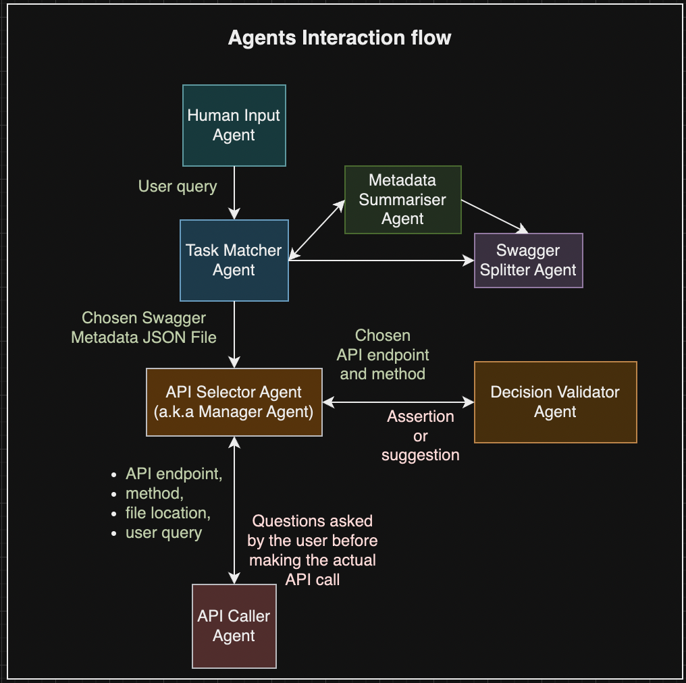
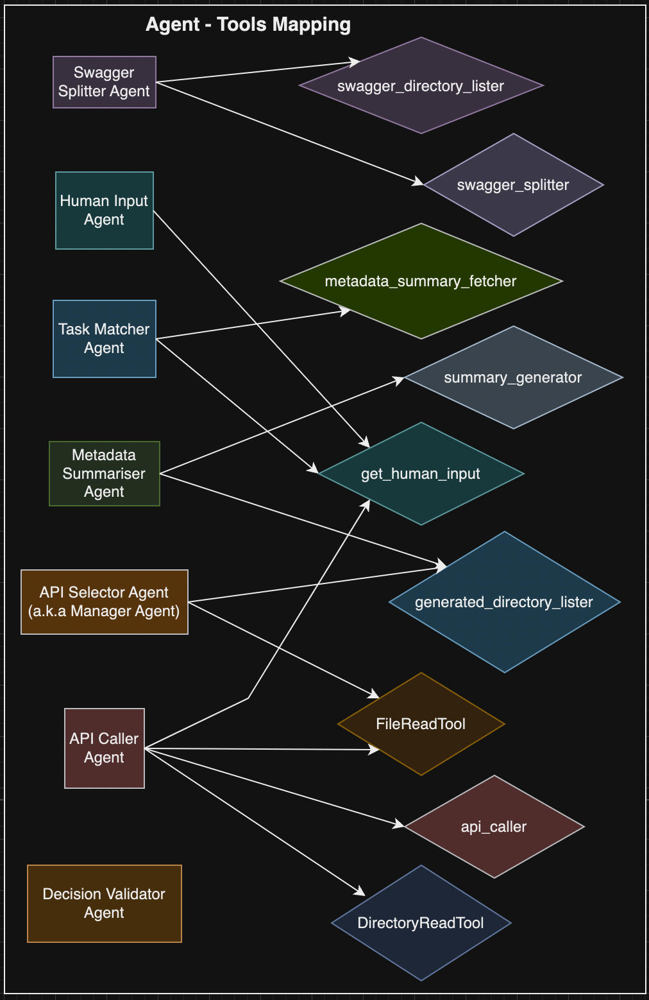

# aiagents

## Structure and Components

### Tools Used
1. **swagger_directory_lister** = list all the files in the '{configuration.swagger_files_directory}' directory
2. **swagger_splitter** = splits the swagger file into multiple files, and generates a metadata file
3. **get_human_input** = gets the input from the user
4. **summary_generator** = passes provided text to an LLM model and returns a detailed summary
5. **generated_directory_lister** = recursively lists the generated directory's content
6. **metadata_summary_fetcher** = reads the generated/summaries/metadata_summaries file's content
7. **api_caller** = makes API calls using the "requests" Python library
8. **FileReadTool** = reads a file's content
9. **DirectoryReadTool** = recursively lists a directory's content
		
        1-7 = Custom Tools 
        8,9 = Crew AI inbuilt tools

 

### Agents in Action
1. **Swagger Splitter Agent** = splits large Swagger JSON files into smaller, manageable files, ensuring efficient processing.
2. **Human Input Agent** = gathers required information from the user and relaying it back to the delegating agent.
3. **Task Matcher Agent** = identifies the best matching Swagger metadata file for a given task using metadata summaries.
4. **Metadata Summarizer Agent** = generates concise, descriptive summaries of API capabilities for all Swagger JSON files.
5. **API Selector Agent** = selects the most appropriate API endpoint and method from a metadata file to fulfill a task.
6. **Decision Validator Agent** = validates whether the actions of the API Selector Agent will satisfactorily fulfill the 
original query and providing clear feedback with reasoning for its decision.
7. **API Caller Agent** = clarifies required and optional parameters for an API call, executing the call, and handling any 
errors or missing information.

 

  

## Tasks and Workflow

### Steps to Perform before 'Start Crew':
<ol>
<li>Choose the OpenAI Provider (Azure OpenAI vs Open AI)</li>
<li>If Azure OpenAI is selected, provide the below details:</li>
<ol type="a">
    <li>Azure OpenAI Deployment</li>
    <li>Azure OpenAI Endpoint</li>
    <li>Azure OpenAI Embedding</li>
</ol>
<li>Provide the OpenAI Key</li>
<li>Provide the API Endpoint on which queries to be resolved</li>
<li>Provide the API Bearer Token need to authenticate requests to the API Endpoint</li>
<li>Upload the Swagger file containing APIs for the API Endpoint provided</li>
<li>Click on 'Upload' to submit the above details</li>
<li>Click on the 'Start Crew' button to start the crew execution</li>
</ol>

### Execution Initiated by 'Start Crew':
1. **Initial Human Input Task** [<b style="color:#479ba0">Human Input Agent</b>] = Prompts the user for their desired action based on the provided Swagger files, and return their response exactly as stated, without any alterations.
2. **Swagger Splitter Task** [<b style="color:#9778a4">Swagger Splitter Agent</b>] = Locates all swagger files in the target directory and split them, unless the 'generated' folder already exists, in which case take no action.
3. **Metadata Summarizer Task** [<b style="color:#99cf78">Metadata Summarizer Agent</b>] = Triggers the 'summary_generator' tool to generate summaries for swagger files from the specified folder, unless the metadata summary already exists, in which case take no action.
4. **Task Matching Task** [<b style="color:#589fc5">Task Matching Agent</b>] =  This is only needed if there are ***multiple Swagger files*** uploaded. Identifies and return the optimal Swagger metadata file based on user task context and metadata summary analysis.
5. **Manager Task** [<b style="color:#ffc482">API Selector Agent</b>] = Identifies and return the most suitable Swagger file based on the metadata summary and user context.
6. **Decision Validator Task** [<b style="color:#c5813d">Decision Validator Agent</b>] = Validates the API Selector Agent's proposed answer against the original query, concluding whether it meets the user's intent and expectations.
7. **API Calling Task** [<b style="color:#cc9999">API Caller Agent</b>] = Makes the API call, ensuring all parameters are identified, requested, and the payload is confirmed before execution.
8. Stop execution. Need to click on 'Reload Crew' to start a new session.